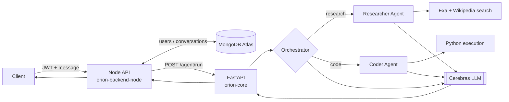

# 🛰️ Orion — Multi-Agent AI System

Orion is a multi-agent AI system built around the ReAct pattern (Thought → Action → Observation). A query comes in, an LLM-based orchestrator decides whether it needs research or code execution, and a specialist agent handles it using real tools — web search, webpage extraction, or Python execution — rather than just generating text. For multi-step requests, a Planner breaks the query into a task list and routes each step through the same pipeline.

The project is also a working example of taking a single-user CLI prototype and rebuilding it for multi-user web use: the original agents were refactored to be stateless, wrapped in a FastAPI service, and put behind a Node.js/Express layer that owns authentication (JWT) and persistence (MongoDB) — so conversation history now survives across requests without leaking between users.

## Architecture



The Node API is the only thing a client talks to. It authenticates the request, loads conversation history from MongoDB, and forwards the query to the Python API, which routes it to the right agent and returns a plain-text answer. A full request-by-request walkthrough lives in [`REPOSITORY_GUIDE.md`](./REPOSITORY_GUIDE.md).

## Concepts implemented

- ReAct-style tool use via native function/tool calling
- LLM-based task routing across specialist agents
- Plan → Execute decomposition for multi-step requests
- Stateless agent design for safe multi-user, concurrent use
- Conversation memory with automatic summarization
- Persisted, authenticated multi-user chat (JWT + MongoDB)

## Tech stack

**Python — `orion-core/`**
- FastAPI — HTTP interface consumed by the Node backend
- Cerebras, via an OpenAI-compatible client — LLM inference
- Exa API, with a Wikipedia fallback — web search
- trafilatura, with a BeautifulSoup fallback — webpage content extraction
- Streamlit — local single-user UI (legacy — see Known Limitations)
- SpeechRecognition + pyttsx3 — optional local voice I/O for `main.py` only (not used by the deployed API)

**Node.js — `orion-backend-node/`**
- Express — HTTP server
- MongoDB Atlas + Mongoose — users, conversations, messages
- JWT + bcrypt — authentication

**Frontend — `orion-frontend/`**
- Not yet implemented. Planned as a React client that talks only to the Node API, never directly to the Python service.

## Project structure

```
Orion/
├── orion-core/                # Python AI engine
│   ├── api/server.py          # FastAPI wrapper — GET /, POST /agent/run
│   ├── src/
│   │   ├── agents/            # orchestrator, researcher, coder
│   │   ├── tools/              # search, webpage fetch, code runner, calculator
│   │   ├── client.py           # LLM client (Cerebras, OpenAI-compatible)
│   │   ├── memory.py           # conversation memory + summarization
│   │   └── planner.py          # multi-step plan → execute
│   ├── main.py                 # CLI, with optional voice I/O
│   ├── app.py                  # Streamlit UI (legacy — see Known Limitations)
│   └── requirements.txt
├── orion-backend-node/        # Node.js auth + persistence API
│   ├── server.js               # entry point — mounts /auth, defines /chat
│   ├── middleware/auth.js      # JWT verification
│   ├── routes/auto.js          # POST /auth/signup, POST /auth/login
│   └── model/                  # User, Conversation, Message (Mongoose)
├── orion-frontend/             # React client (not yet implemented)
└── REPOSITORY_GUIDE.md         # full file-by-file walkthrough
```

## Getting started

Orion runs as two services. Start the Python API first — the Node API expects it to already be reachable.

### 1. Python API (`orion-core/`)

```bash
cd orion-core
python -m venv venv
venv\Scripts\activate        # Windows
# source venv/bin/activate   # macOS/Linux
pip install -r requirements.txt
```

Create `orion-core/.env`:

```
OPENROUTER_API_KEY=your-cerebras-key   # name is historical — client.py reads this key but points it at Cerebras
EXA_API_KEY=your-exa-key
```

Both variables are required — the app fails to start without `EXA_API_KEY` set, since the search tool reads it at import time. Get a Cerebras key at [cerebras.ai](https://cerebras.ai) and an Exa key at [exa.ai](https://exa.ai).

Run it:

```bash
uvicorn api.server:app --reload --port 8000
```

### 2. Node API (`orion-backend-node/`)

```bash
cd orion-backend-node
npm install
```

Create `orion-backend-node/.env`:

```
MONGO_URI=your-mongodb-atlas-uri
JWT_SECRET=any-long-random-string
PORT=5000
ORION_BACKEND_URL=http://127.0.0.1:8000/agent/run
```

Run it:

```bash
node server.js
```

Exercise the full path with `POST /auth/signup` → `POST /auth/login` → `POST /chat` (with the returned JWT as a Bearer token).

## Known limitations & roadmap

- **Frontend not started.** `orion-frontend/` is currently an empty placeholder.
- **The Streamlit UI (`app.py`) is currently broken.** It calls an `Orchestrator.run()` method that no longer exists after the routing refactor. Use the CLI (`main.py`) or the API directly until it's reconnected to the `route → memory → run_route` flow.
- **The code-execution tool isn't sandboxed.** `run_python_code` runs on the host process with no OS-level isolation, resource limits, or network restriction. Don't expose `/agent/run` publicly without adding real isolation first.
- **No automated tests yet.**
- **Next up:** React frontend → RAG + a fine-tuned model (v3) → a standalone agent-debugger/tracer tool for observability.

## Learn more

For a file-by-file walkthrough of how a request actually moves through the system, see [`REPOSITORY_GUIDE.md`](./REPOSITORY_GUIDE.md).

## Author

**Shivansh Gupta**
B.Tech CSE (AI/ML) — Lovely Professional University
GitHub: [@shivansh-arch](https://github.com/shivansh-arch)