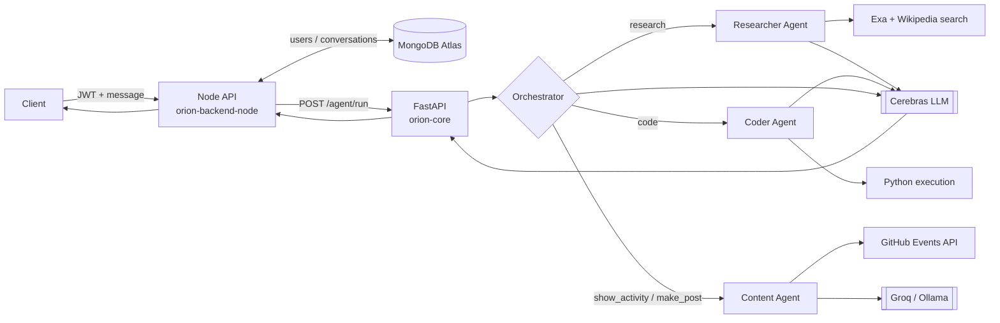

# 🛰️ Orion — Multi-Agent AI System

Orion is a multi-agent AI system built around the ReAct pattern (Thought → Action → Observation). A query comes in, an LLM-based orchestrator decides whether it needs research, code execution, or one of the content-automation flows, and a specialist agent handles it using real tools — web search, webpage extraction, Python execution, or GitHub/LeetCode activity collection — rather than just generating text. For multi-step requests, a Planner breaks the query into a task list and routes each step through the same pipeline.

The project is also a working example of taking a single-user CLI prototype and rebuilding it for multi-user web use: the original agents were refactored to be stateless, wrapped in a FastAPI service, and put behind a Node.js/Express layer that owns authentication (JWT) and persistence (MongoDB) — so conversation history now survives across requests without leaking between users.

## Architecture


```mermaid
flowchart LR
    U[Client] -->|JWT + message| N[Node API<br/>orion-backend-node]
    N <-->|users / conversations| DB[(MongoDB Atlas)]
    N -->|POST /agent/run| P[FastAPI<br/>orion-core]
    P --> O{Orchestrator}
    O -->|research| R[Researcher Agent]
    O -->|code| C[Coder Agent]
    O -->|show_activity / make_post| CA[Content Agent]
    R --> S[Exa + Wikipedia search]
    C --> X[Python execution]
    CA --> GH[GitHub Events API]
    CA --> LLM2[[Groq / Ollama]]
    R --> L[[Cerebras LLM]]
    C --> L
    O --> L
    L --> P --> N --> U
```

The Node API is the only thing a client talks to. It authenticates the request, loads conversation history from MongoDB, and forwards the query to the Python API, which routes it to the right agent and returns a plain-text answer. The Content Agent routes (`show_activity`, `make_post`) are currently CLI-only (see below) and are not yet exposed over the FastAPI/Node path. A full request-by-request walkthrough lives in [`REPOSITORY_GUIDE.md`](./REPOSITORY_GUIDE.md).

## Concepts implemented

- ReAct-style tool use via native function/tool calling
- LLM-based task routing across specialist agents
- Plan → Execute decomposition for multi-step requests
- Stateless agent design for safe multi-user, concurrent use
- Conversation memory with automatic summarization
- Persisted, authenticated multi-user chat (JWT + MongoDB)
- Activity-grounded content generation with an interview step, a factual-grounding critic, and a feedback-driven revision loop (Content Agent)

## Tech stack

**Python — `orion-core/`**
- FastAPI — HTTP interface consumed by the Node backend
- Cerebras, via an OpenAI-compatible client — LLM inference
- Exa API, with a Wikipedia fallback — web search
- trafilatura, with a BeautifulSoup fallback — webpage content extraction
- Streamlit — local single-user UI (legacy — see Known Limitations)
- SpeechRecognition + pyttsx3 — optional local voice I/O for `main.py` only (not used by the deployed API)
- Groq API and/or a local Ollama model — LLM backend for the Content Agent (interview, writing, and critique), selectable per call via a shared provider interface
- GitHub REST API (`requests`) — activity collection for the Content Agent

**Node.js — `orion-backend-node/`**
- Express — HTTP server
- MongoDB Atlas + Mongoose — users, conversations, messages
- JWT + bcrypt — authentication

**Frontend — `orion-frontend/`**
- Not yet implemented. Planned as a React client that talks only to the Node API, never directly to the Python service.

## Project structure

```
Orion/
├── orion-core/                # Python AI engine
│   ├── api/server.py          # FastAPI wrapper — GET /, POST /agent/run
│   ├── src/
│   │   ├── agents/            # orchestrator, researcher, coder
│   │   ├── tools/              # search, webpage fetch, code runner, calculator
│   │   ├── content_agent/      # activity-grounded post generation (see below)
│   │   │   ├── collector.py        # GitHub/LeetCode activity, deduped + allowlisted
│   │   │   ├── interviewer.py      # dynamic follow-up questions, LLM-decided stop
│   │   │   ├── writer.py           # generate_post / revise_post, personal-style aware
│   │   │   ├── critic.py           # factual-grounding check against source material
│   │   │   ├── cli.py              # show_activity() / run_post_flow() entry points
│   │   │   ├── llm_provider.py     # Ollama / Groq, swappable behind one interface
│   │   │   ├── integrations/       # github.py, leetcode.py
│   │   │   └── memory/             # personal_memory.py (static style profile; others TBD)
│   │   ├── client.py           # LLM client (Cerebras, OpenAI-compatible)
│   │   ├── memory.py           # conversation memory + summarization
│   │   └── planner.py          # multi-step plan → execute
│   ├── main.py                 # CLI, with optional voice I/O
│   ├── app.py                  # Streamlit UI (legacy — see Known Limitations)
│   └── requirements.txt
├── orion-backend-node/        # Node.js auth + persistence API
│   ├── server.js               # entry point — mounts /auth, defines /chat
│   ├── middleware/auth.js      # JWT verification
│   ├── routes/auto.js          # POST /auth/signup, POST /auth/login
│   └── model/                  # User, Conversation, Message (Mongoose)
├── orion-frontend/             # React client (not yet implemented)
└── REPOSITORY_GUIDE.md         # full file-by-file walkthrough
```

## Getting started

Orion runs as two services. Start the Python API first — the Node API expects it to already be reachable.

### 1. Python API (`orion-core/`)

```bash
cd orion-core
python -m venv venv
venv\Scripts\activate        # Windows
# source venv/bin/activate   # macOS/Linux
pip install -r requirements.txt
```

Create `orion-core/.env`:

```
OPENROUTER_API_KEY=your-cerebras-key   # name is historical — client.py reads this key but points it at Cerebras
EXA_API_KEY=your-exa-key

# Content Agent
GITHUB_TOKEN=your-github-fine-grained-token   # Contents + Metadata (+ Pull requests / Issues if you want those events), read-only
GROQ_API_KEY=your-groq-key                    # used by content_agent's writer/interviewer/critic by default

# LinkedIn publishing — app + OAuth scaffolding done, token exchange not yet wired in
LINKEDIN_CLIENT_ID=your-linkedin-client-id
LINKEDIN_CLIENT_SECRET=your-linkedin-client-secret
```

All of `OPENROUTER_API_KEY` and `EXA_API_KEY` are required for the core agents — the app fails to start without `EXA_API_KEY` set, since the search tool reads it at import time. Get a Cerebras key at [cerebras.ai](https://cerebras.ai) and an Exa key at [exa.ai](https://exa.ai). `GITHUB_TOKEN` and `GROQ_API_KEY` are only required if you use the Content Agent routes. The LinkedIn keys aren't consumed by any code yet — see Known Limitations.

For `GITHUB_TOKEN`: create a fine-grained personal access token at `github.com/settings/tokens?type=beta`, scoped to the repos you want tracked, with Contents (read-only) and Metadata (read-only) at minimum. Note that `collect_github_activity()` reads from GitHub's public `/users/{username}/events` feed, so a repo also needs to be **public** for its activity to show up, regardless of token scope.

Content Agent LLM calls default to Groq but can run against a local Ollama model instead (`provider="ollama"` in `generate_post`/`revise_post`/`gather_context`, or via `get_provider("ollama")`); no key needed, just a running `ollama serve` with a pulled model (e.g. `llama3.2:3b`).

Run it:

```bash
uvicorn api.server:app --reload --port 8000
```

### 2. Node API (`orion-backend-node/`)

```bash
cd orion-backend-node
npm install
```

Create `orion-backend-node/.env`:

```
MONGO_URI=your-mongodb-atlas-uri
JWT_SECRET=any-long-random-string
PORT=5000
ORION_BACKEND_URL=http://127.0.0.1:8000/agent/run
```

Run it:

```bash
node server.js
```

Exercise the full path with `POST /auth/signup` → `POST /auth/login` → `POST /chat` (with the returned JWT as a Bearer token).

### 3. Content Agent (CLI only, for now)

From `orion-core/`, with the venv active:

```bash
python main.py
```

Then type a natural-language request — the orchestrator classifies it into one of four routes (`research`, `code`, `show_activity`, `make_post`):

- **`show_activity`** — e.g. *"show me my recent GitHub activity"* — prints the last 24h of collected, deduplicated, allowlisted GitHub/LeetCode activity.
- **`make_post`** — e.g. *"make a post"* — walks through the full flow: pick an activity item → answer a short, dynamically-generated set of follow-up questions → see a generated draft → see a grounding check against everything you actually said → approve, discard, or give feedback for another revision (capped at 3, with a restart option after the cap).

The grounding check is advisory, not enforced — nothing currently blocks approving a draft the critic has flagged as ungrounded. Read the verdict before approving.

## Known limitations & roadmap

- **Frontend not started.** `orion-frontend/` is currently an empty placeholder.
- **The Streamlit UI (`app.py`) is currently broken.** It calls an `Orchestrator.run()` method that no longer exists after the routing refactor. Use the CLI (`main.py`) or the API directly until it's reconnected to the `route → memory → run_route` flow.
- **The code-execution tool isn't sandboxed.** `run_python_code` runs on the host process with no OS-level isolation, resource limits, or network restriction. Don't expose `/agent/run` publicly without adding real isolation first.
- **LinkedIn publishing is not implemented yet.** The developer app, OAuth product access (Share on LinkedIn + Sign In with LinkedIn via OpenID Connect), and redirect URL are configured, and `LINKEDIN_CLIENT_ID`/`LINKEDIN_CLIENT_SECRET` are available in `.env`, but there is no code yet for the authorization redirect, the local callback listener, or the token exchange. `run_post_flow()` currently ends at an approved draft printed to the terminal — publishing is manual (copy/paste) until this is built.
- **Content Agent memory is minimal.** Only a static `personal_memory.py` style profile exists. Activity memory (cross-day continuity), content memory (dedup against previously posted content), and learning/knowledge memory (progression tracking) are all still unbuilt.
- **Content Agent routes aren't on the FastAPI/Node path.** `show_activity` and `make_post` currently only work through the local CLI (`main.py`), since `gather_context()` and the revision loop depend on interactive terminal `input()`.
- **No automated tests yet.**
- **Next up:** LinkedIn OAuth + publish step → React frontend → RAG + a fine-tuned model (v3) → a standalone agent-debugger/tracer tool for observability.

## Learn more

For a file-by-file walkthrough of how a request actually moves through the system, see [`REPOSITORY_GUIDE.md`](./REPOSITORY_GUIDE.md).

## Author

**Shivansh Gupta**
B.Tech CSE (AI/ML) — Lovely Professional University
GitHub: [@shivansh-arch](https://github.com/shivansh-arch)
