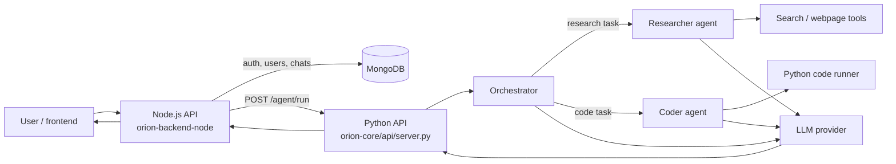

# Orion Repository Guide — From Intern to Contributor

> Read this file from top to bottom once. Then use the **Suggested learning path** at the end and open the linked source files as you go.

## 1. What this repository is

Orion is an AI-assistant learning project made of **two backend applications**:

1. **`orion-core/`** — the Python AI brain. It talks to an LLM, chooses an AI agent, calls tools such as web search or Python execution, and returns an answer.
2. **`orion-backend-node/`** — the Node.js application backend. It handles sign-up/login, verifies JWT tokens, stores conversations in MongoDB, and forwards authenticated chat messages to the Python brain.

There is no implementation in `orion-frontend/` at present. A frontend can call the Node backend; it should not call the Python agent directly.

## 2. The big picture



Think of it like a company:

| Part | Company analogy | Job |
|---|---|---|
| Node backend | Front desk + records department | authenticates people and owns stored chat data |
| Python API | Operations manager | receives an AI request and starts the correct workflow |
| Orchestrator | Team lead | decides whether Research or Coding should handle the task |
| Researcher/Coder | Specialist employees | use tools, then produce an answer |
| LLM | The reasoning engine | classifies and generates natural-language/tool-call responses |
| MongoDB | Company database | stores users, conversations, and messages |

## 3. Normal chat request, step by step

```mermaid
sequenceDiagram
    participant UI as Frontend/User
    participant Node as Node /chat
    participant DB as MongoDB
    participant Py as Python /agent/run
    participant AI as LLM + tools

    UI->>Node: POST /chat + Bearer JWT + message
    Node->>Node: Verify JWT
    Node->>DB: Create/find conversation; save user message
    Node->>DB: Load up to 20 earlier messages
    Node->>Py: query + prior history
    Py->>AI: Route request, then run selected agent
    AI-->>Py: Answer (and optionally tool results)
    Py-->>Node: { response: ... }
    Node->>DB: Save assistant answer
    Node-->>UI: Agent response + conversationId
```

## 4. Folder map

```text
orion/
├── README.md                   # Short project overview
├── .env                        # Secrets/configuration; never commit this
├── .gitignore                  # Files Git must ignore
├── orion-backend-node/         # Node.js auth + chat persistence API
│   ├── server.js
│   ├── middleware/auth.js
│   ├── model/
│   └── routes/auto.js
├── orion-core/                 # Python AI system
│   ├── api/server.py           # HTTP bridge for the Node API
│   ├── app.py                  # Streamlit UI
│   ├── main.py                 # Terminal UI
│   └── src/                    # AI components
└── orion-frontend/             # Empty placeholder currently
```

## 5. Root-level files

| File | Plain-English purpose |
|---|---|
| `README.md` | The original project introduction and setup notes. It describes the Python agent more than the newer Node/Mongo chat layer. |
| `.env` | Holds secrets such as API keys. Never print it, commit it, or send it in screenshots. |
| `.gitignore` | Stops secrets, virtual environments, caches, `node_modules`, and editor files from being committed. |
| `REPOSITORY_GUIDE.md` | This learning guide. |

## 6. Node backend: login, authorization, and chat storage

### `orion-backend-node/server.js`

This is the Node application's entry point.

It does five main things:

1. Loads environment variables with `dotenv`.
2. Creates an Express server and connects Mongoose to MongoDB.
3. Mounts authentication routes under `/auth`.
4. Defines the protected `POST /chat` endpoint.
5. Starts listening on port `5000` unless `PORT` is set.

### What happens inside `POST /chat`

- `auth` middleware runs first. Invalid or missing tokens are rejected.
- The request accepts `message` (or `query`) and optional `conversationId` naming variants.
- It validates that the message is present and not more than 2,000 characters.
- It creates a new conversation for a first message, or checks that an existing conversation belongs to the authenticated user.
- It stores the user message in MongoDB.
- It sends the new query plus earlier messages to `http://127.0.0.1:8000/agent/run` by default.
- It stores the assistant text returned by Python, then returns it to the caller along with `conversationId`.

Important helpers:

- `extractAssistantContent()` looks for answer text in several possible response shapes.
- `AbortController` prevents the Node request from waiting forever; `ORION_TIMEOUT_MS` is currently 8 seconds.
- `ORION_BACKEND_URL` lets deployment use a different Python-agent address.

### `orion-backend-node/middleware/auth.js`

This is an Express middleware function. Middleware is code that runs **before** the final route handler.

It expects this header:

```http
Authorization: Bearer <JWT token>
```

It verifies the token with `JWT_SECRET`. On success it puts the user ID and email into `req.user`, so `/chat` knows who owns the request. On failure it returns HTTP 401.

### `orion-backend-node/routes/auto.js`

Despite the filename, this is the authentication router.

| Route | Job |
|---|---|
| `POST /auth/signup` | Validates email/password, hashes the password with bcrypt, and creates a user. |
| `POST /auth/login` | Verifies the password and returns a JWT valid for seven days. |

Passwords are hashed, not stored as plain text. That is a fundamental security rule.

### `orion-backend-node/model/User.js`

Defines the MongoDB user shape (a Mongoose schema):

```text
User
├── email: required, unique, lowercased
├── password: required bcrypt hash
├── createdAt: automatic
└── updatedAt: automatic
```

### `orion-backend-node/model/Conversation.js`

A conversation is one chat thread. It stores:

- `userId`: owner of the chat
- `title`: first 40 characters of the first message
- `createdAt`: creation time

### `orion-backend-node/model/Message.js`

A message belongs to one conversation. It stores:

- `conversationId`
- `role`: either `user` or `assistant`
- `content`
- `timestamp`

### `orion-backend-node/package.json`

The Node package manifest. It lists runtime libraries:

- `express` — HTTP server
- `mongoose` — MongoDB object mapper
- `bcrypt` — password hashing
- `jsonwebtoken` — JWT creation/verification
- `dotenv` — environment variables

The `test` script is still the default placeholder, so it intentionally fails and is **not** a real test suite yet.

### `orion-backend-node/package-lock.json`

A generated lockfile. It pins exact dependency versions so every developer installs the same dependency tree. Do not hand-edit it; npm updates it.

### `orion-backend-node/.env`

Local Node configuration, expected to include at least `MONGO_URI` and `JWT_SECRET` (and optionally `PORT` / `ORION_BACKEND_URL`). Treat it as secret.

## 7. Python core: the AI brain

### `orion-core/api/server.py`

This is a FastAPI service that the Node backend calls.

- `GET /` is a small health endpoint.
- `POST /agent/run` accepts a `query` and optional earlier `history`.
- It asks the orchestrator to select a route (`research` or `code`).
- It creates fresh memory for this request and runs the selected specialist.
- It returns `{ "response": result }`.

The global `client` and `orchestrator` are built once when this module starts.

### `orion-core/src/client.py`

A thin wrapper around the OpenAI Python SDK.

It loads `OPENROUTER_API_KEY` from Streamlit secrets or `.env`, but configures the SDK to use Cerebras (`https://api.cerebras.ai/v1`) and model `gemma-4-31b`. The variable name is historical/misleading: ensure the key is valid for the configured provider.

Methods:

- `chat()` — normal LLM response as text.
- `chat_with_tools()` — LLM call that permits structured function/tool calls.

### `orion-core/src/agents/orchestrator.py`

The routing manager.

1. `route(query)` asks the LLM to reply with exactly `research` or `code`.
2. `get_system_prompt(route)` selects the specialist's instructions.
3. `run_route(...)` calls either `ResearcherAgent` or `CoderAgent`.

It deliberately uses a separate routing call before the main answer call.

### `orion-core/src/agents/researcher.py`

The research specialist. It follows a tool-use loop (often called **ReAct**):

```text
Add user query → ask LLM → LLM requests tool? → run tool → give result back → ask again
                                              └─ no → return final answer
```

Available tools are `search` and `fetch_webpage`. It permits up to 10 iterations and returns an answer plus activity/tool metadata.

### `orion-core/src/agents/coder.py`

The coding specialist. Its structure mirrors the researcher, but its only tool is `run_python_code`. It also returns answer/iteration/tool metadata.

### `orion-core/src/memory.py`

Request-scoped conversation memory.

- `add()` adds messages in the chat-completion format.
- `get_messages()` returns messages and summarizes when the count exceeds `max_messages`.
- `summarize()` preserves the system prompt and current active user/tool chain, then asks the LLM to compress older history.
- `build_memory()` initializes memory with a system prompt and optional saved history from MongoDB.

This prevents the context from growing forever, but summarization itself costs an LLM call.

### `orion-core/src/planner.py`

Used for bigger tasks.

1. `plan()` asks the LLM to produce a numbered task list.
2. `execute()` runs each task through the orchestrator.
3. Later tasks receive earlier task results as context.
4. `run()` is the public convenience method returning both task list and results.

### `orion-core/src/tools/search.py`

Search tool for the researcher:

- `deep_search()` searches Exa and returns three short content results.
- `simple_search()` calls Wikipedia's APIs.
- `search()` tries Exa first and falls back to Wikipedia if Exa fails.

It reads `EXA_API_KEY` when imported, so missing configuration can stop the app from starting.

### `orion-core/src/tools/web.py`

Downloads a webpage, attempts main-content extraction with `trafilatura`, falls back to BeautifulSoup, and limits returned text to 2,000 characters.

### `orion-core/src/tools/code_runner.py`

Writes supplied Python into a temporary file, runs `python <temp-file>`, captures output, and stops after 10 seconds. It deletes the temporary file in `finally`.

**Security note:** this is not a true sandbox. It runs code on the host machine under the application's permissions. Do not expose it to untrusted users without OS/container isolation, resource limits, and a network policy.

### `orion-core/src/tools/calculator.py`

Evaluates a math expression with Python built-ins removed and the `math` module available. It returns either the string result or an error string.

### `orion-core/src/voice.py`

Local voice input/output:

- `listen()` records from the microphone and uses Google's recognizer.
- `speak()` uses `pyttsx3` text-to-speech.

### `orion-core/src/__init__.py`, `src/agents/__init__.py`, `src/tools/__init__.py`

Empty package marker files. They tell Python these folders are importable packages.

## 8. User interfaces and developer files

### `orion-core/main.py`

Command-line interface. Run it with `python main.py` from `orion-core`.

Commands:

- `quit`
- `voice on` / `voice off`
- `plan: <large task>`

For normal prompts it correctly performs route → system prompt → memory → `run_route`.

### `orion-core/app.py`

Streamlit web interface. It displays chat history, agent status, thinking steps, and called tools. Planner mode calls `planner.run(...)` and formats every subtask result.

### `orion-core/requirements.txt`

Python dependency list used by `pip install -r requirements.txt`.

### `orion-core/.devcontainer/devcontainer.json`

Configuration for GitHub Codespaces / VS Code Dev Containers. It creates a Python 3.11 environment, installs requirements, and starts Streamlit on port 8501.

### `orion-core/test.py`

Empty file. It is a placeholder, not a test.

### `orion-core/test_mic.py`

A manual microphone diagnostic. It prints discovered microphone names.

### `orion-core/api/requriment.py`

Empty file with a likely spelling mistake in its filename (`requriment` rather than `requirement`). It currently has no effect.

### `orion-core/pip`

A small requirements-like file. It is not a standard Python filename and is not used by the documented installation command.

## 9. Current gaps and issues worth fixing next

These are learning notes, not hidden behavior:

1. **Streamlit Direct mode is broken.** `app.py` calls `orchestrator.run(prompt)`, but `Orchestrator` has no `run` method. It should follow the same route → memory → `run_route` sequence used by `main.py` or add a matching `run()` method.
2. **Some imports are missing from `requirements.txt`.** `web.py` imports `trafilatura`; `voice.py` imports `speech_recognition` and `pyttsx3`. Add these dependencies before using those features in a clean environment.
3. **There is no automated test suite.** Node's `npm test` is a placeholder and Python's `test.py` is empty.
4. **The README is stale.** It describes one Python application and does not document the MongoDB/Node API layer.
5. **The code runner needs real isolation** before it can safely handle untrusted code.
6. **Store database indexes deliberately.** At minimum, message lookups by `conversationId` and conversation lookups by `userId` will benefit from indexes as data grows.

## 10. Suggested learning path

1. Start with `orion-backend-node/server.js` and trace one `/chat` request.
2. Read the three Mongo models and `middleware/auth.js`.
3. Open `orion-core/api/server.py`, then `src/agents/orchestrator.py`.
4. Read one agent (`researcher.py`) alongside its tools (`search.py`, `web.py`).
5. Compare `coder.py` with `researcher.py`; notice the common tool-loop pattern.
6. Read `memory.py` and `planner.py` last—they explain how the system handles longer conversations and complex tasks.
7. Fix the Streamlit Direct-mode issue, add tests, then update the README. Those are excellent first intern-sized contributions.

## 11. Useful local run commands

```powershell
# Python core: install dependencies
cd orion-core
..\venv\Scripts\python.exe -m pip install -r requirements.txt

# Python HTTP API for the Node server
..\venv\Scripts\python.exe -m uvicorn api.server:app --reload --port 8000

# Python Streamlit UI
..\venv\Scripts\python.exe -m streamlit run app.py

# Node API (requires its .env and MongoDB)
cd ..\orion-backend-node
node server.js
```

Run the Python API and Node API in separate terminals when testing `/chat`.